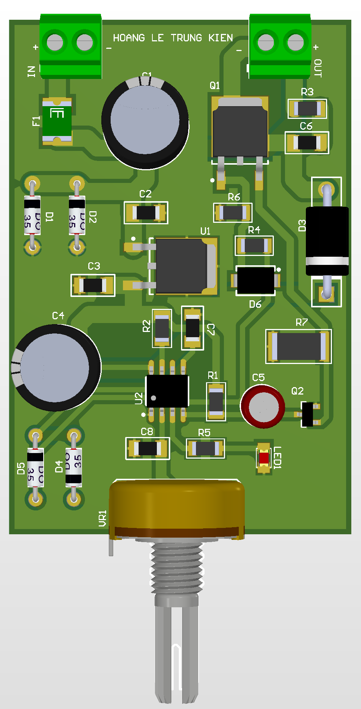

# Analog Motor Soft Start Controller

Hardware PWM motor controller.

## Function
Smooth motor startup without MCU.

## Key Specifications
- PWM: NE555
- Regulator: 7812
- MOSFET: IRFZ44N
- Feature: Soft-start capacitor

## Hardware Preview

---
Designed by HOANG LE TRUNG KIEN
